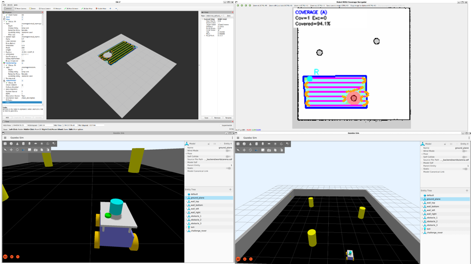
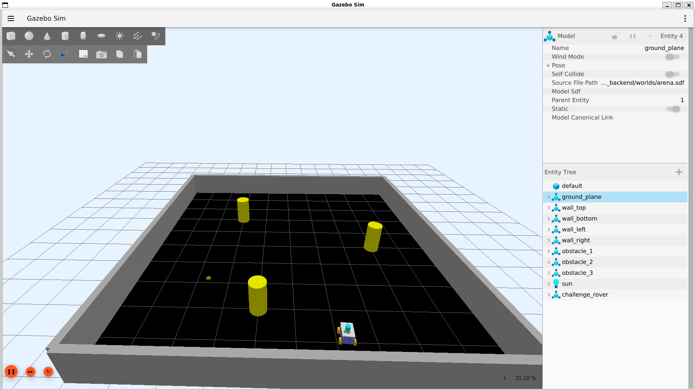
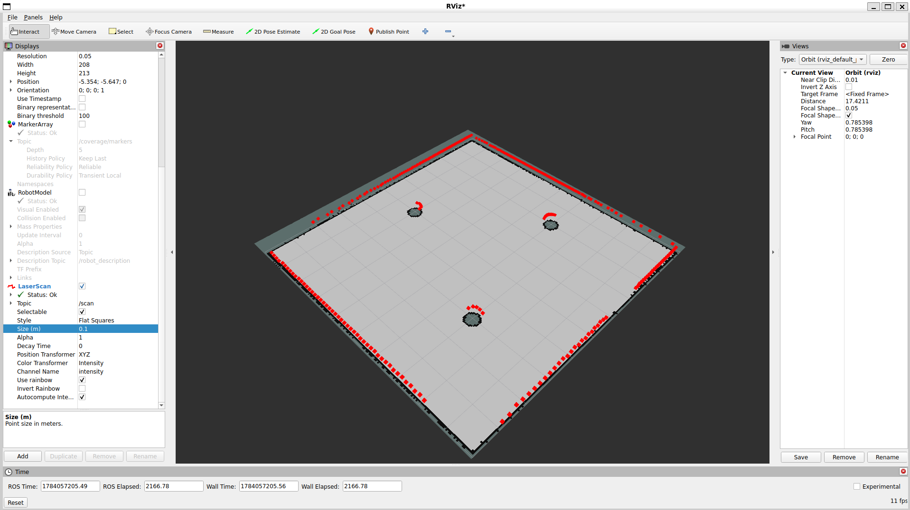
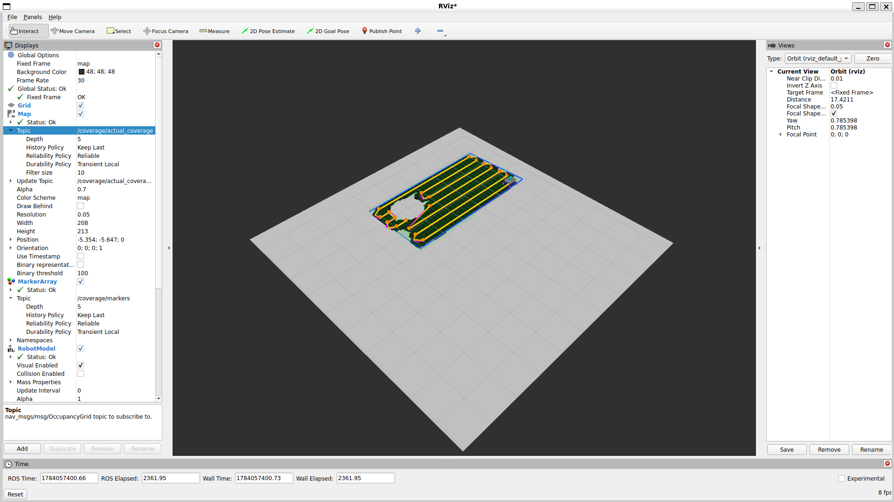
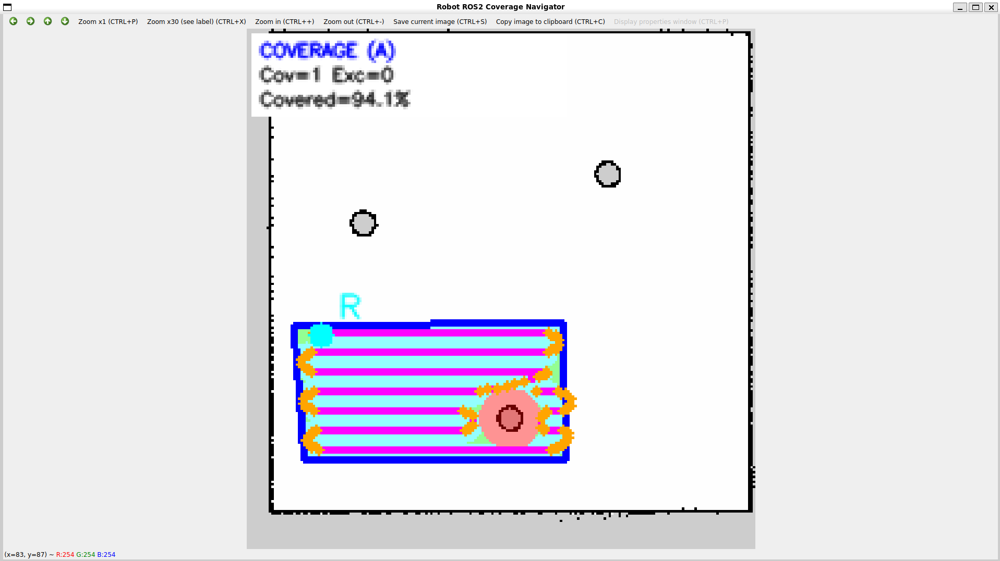

# ROS 2 Autonomous Area Coverage Robot

Autonomous mobile robot simulation, SLAM mapping, and boustrophedon area coverage using **ROS 2 Jazzy**, **Gazebo Harmonic**, **SLAM Toolbox**, and **Nav2**.

<p align="center">
  
</p>

---

## Project Overview

- **Task 1 Robot and Simulation Setup:** Developed a custom four-wheel robot inside a 10×10 meter Gazebo arena equipped with walls, three static cylindrical obstacles, lidar, IMU, odometry, TF, and a ROS and Gazebo bridge.
- **Task 2 SLAM and Map Building:** Implemented teleoperation-based mapping using SLAM Toolbox and saved the generated map using Nav2.
- **Task 3 Area Coverage System:** Developed a user-defined area coverage system with optional exclusion zones, obstacle filtering, reachability validation, boustrophedon path planning, and autonomous execution using Nav2.

### Main Features

- Custom skid-steer robot simulated in Gazebo Harmonic
- 2D lidar, IMU, odometry, joint states, and TF integration
- SLAM mapping and AMCL localization
- User-defined coverage and exclusion polygons
- Obstacle-aware and reachability-validated coverage planning
- Boustrophedon path generation with A* segment connections
- Nav2 mission execution with RViz visualization, cancellation, retry, and progress monitoring

---

## System Architecture

The system consists of six main components:

- **Gazebo Harmonic** simulates the robot, arena, obstacles, and sensors.
- **ros_gz_bridge** connects Gazebo with ROS 2 through `/scan`, `/odom`, `/imu`, `/tf`, `/clock`, and `/cmd_vel`.
- **SLAM Toolbox** builds the occupancy-grid map during the mapping stage.
- **Map Server** loads and publishes the saved occupancy-grid map, while **AMCL** estimates the robot pose during autonomous navigation.
- **Coverage Navigator** processes coverage and exclusion polygons, validates reachable areas, generates the boustrophedon route, and sends navigation goals.
- **Nav2 and RViz2** execute the route and display the map, costmaps, paths, markers, and actual covered area.

### Core Interfaces

| Interface | Type | Purpose |
|---|---|---|
| `/scan` | `LaserScan` | Mapping, localization, and obstacle detection |
| `/odom` | `Odometry` | Robot motion estimation |
| `/cmd_vel` | `Twist` | Robot velocity command |
| `/map` | `OccupancyGrid` | Arena map |
| `/coverage/markers` | `MarkerArray` | Coverage visualization |
| `/coverage/visual_path` | `Path` | Complete coverage path |
| `/coverage/active_chunk` | `Path` | Current executed route |
| `/coverage/actual_coverage` | `OccupancyGrid` | Estimated covered area |
| `/navigate_to_pose` | Nav2 Action | Move to the route entry point |
| `/spin` | Nav2 Action | Align robot orientation |
| `/navigate_through_poses` | Nav2 Action | Execute coverage waypoints |

---
## Requirements

- Ubuntu 24.04
- ROS 2 Jazzy Jalisco
- Gazebo Harmonic
- Python 3
- OpenCV, NumPy, and PyYAML

---

## How to Setup
In Ubuntu Terminal (I use Ubuntu 24.04)

```bash
mkdir -p ~/ros2_ws/src
cd ~/ros2_ws/src

git clone https://github.com/aryadiiptaa/robot_ros_backend.git

cd ~/ros2_ws
source /opt/ros/jazzy/setup.bash

rosdep install --from-paths src --ignore-src -r -y

colcon build   --packages-select robot_ros_backend   --symlink-install

source install/setup.bash
```
---

## How to Use

### 1. Start the simulation (Task 1)
Open the terminal

```bash
source /opt/ros/jazzy/setup.bash
source ~/ros2_ws/install/setup.bash

ros2 launch robot_ros_backend spawn.launch.py
```

<p align="center">
  
</p>

Main bridged topics:

```text
/clock
/scan
/odom
/tf
/joint_states
/imu
/cmd_vel
```

---

### 2. Build the map (Task 2)
While the Gazebo still running

### Start SLAM - Terminal 2

```bash
ros2 launch robot_ros_backend slam.launch.py
```

### Start teleoperation - Terminal 3

```bash
ros2 run teleop_twist_keyboard teleop_twist_keyboard
```

### Start RViz2 - Terminal 4

```bash
rviz2 --ros-args -p use_sim_time:=true
```

Recommended RViz configuration:

```text
Fixed Frame: map
Map: /map
LaserScan: /scan
```
Drive around the complete arena

<p align="center">
  
</p>

### Save the Map - Terminal 5

Save the map:

```bash
ros2 run nav2_map_server map_saver_cli -f ~/ros2_ws/src/robot_ros_backend/maps/arena_map
```

Rebuild after replacing the packaged map:

```bash
cd ~/ros2_ws
colcon build --packages-select robot_ros_backend --symlink-install
source install/setup.bash
```

---

### 3. Run autonomous coverage (Task 3)

Stop SLAM before starting Nav2 to avoid multiple `map → odom` publishers. Restart the Gazebo

### Start Nav2 - Terminal 2

```bash
ros2 launch robot_ros_backend nav.launch.py
```

### Start RViz2 - Terminal 3

```bash
rviz2 --ros-args -p use_sim_time:=true
```

Recommended displays:

| Display | Topic |
|---|---|
| Map | `/map` |
| Map | `/global_costmap/costmap` |
| Map | `/local_costmap/costmap` |
| MarkerArray | `/coverage/markers` |
| Path | `/coverage/visual_path` |
| Path | `/coverage/nav_waypoints` |
| Path | `/coverage/active_chunk` |
| Map | `/coverage/actual_coverage` |
| LaserScan | `/scan` |

<p align="center">
  
</p>

Use **2D Pose Estimate** if the AMCL pose does not match the robot position.

### Start the coverage node - Terminal 4

```bash
ros2 run robot_ros_backend coverage_navigator.py \
  --ros-args \
  -p use_sim_time:=true
```

---

## Coverage Navigator UI

### Controls

| Input | Action |
|---|---|
| Left click | Add a polygon point |
| Right click | Save the polygon according to the active mode |
| `A` | Switch to coverage mode |
| `D` | Switch to exclusion mode |
| `P` | Generate and execute the coverage route |
| `X` | Cancel the active mission |
| `C` | Clear polygons and generated data |
| `Esc` | Exit the application |

### Workflow

1. Draw at least three points using the left mouse button.
2. Right-click to save the coverage polygon.
3. To add an exclusion area, press `D`, draw the polygon, and right-click.
4. Press `A` to return to coverage mode when adding another coverage area.
5. Press `P` to generate and execute the route.
6. Monitor the mission in RViz2.

<p align="center">
  
</p>

---

## QoS Configuration

Map, path, and marker topics are persistent state and may only be published when they change.

Use this QoS in RViz:

```text
Reliability: Reliable
Durability: Transient Local
```

This allows a late subscriber such as RViz to receive the latest map or marker.

Real-time topics remain volatile:

```text
/scan
/odom
/cmd_vel
```

Old sensor data and velocity commands should not be replayed.

---

## Demo

```text
https://youtu.be/HZmPA8AdZ_E 
```